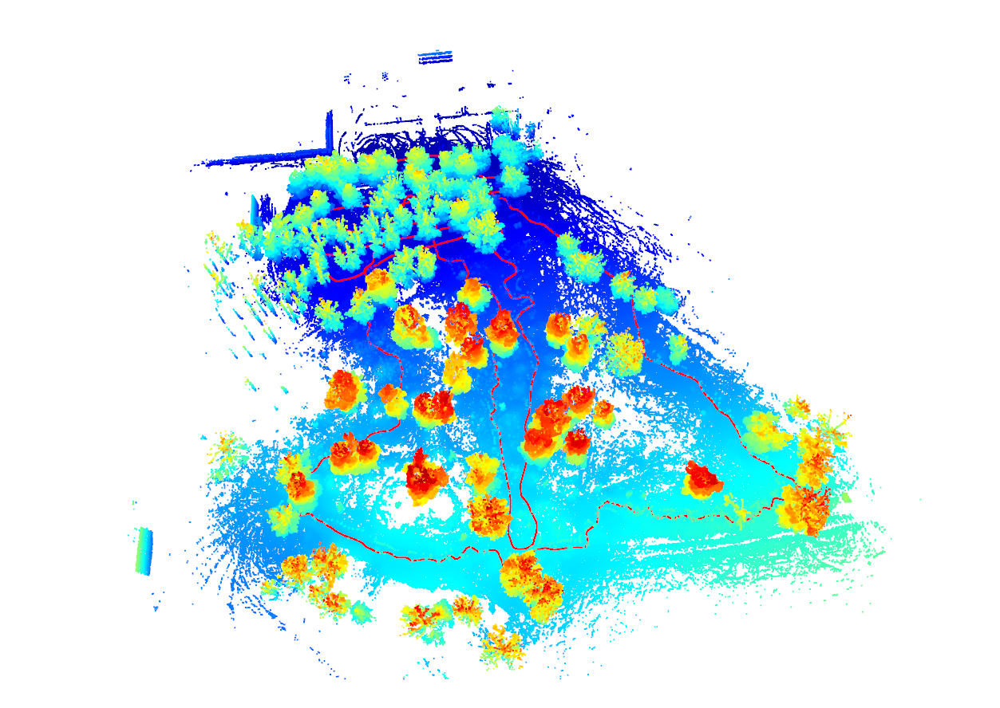
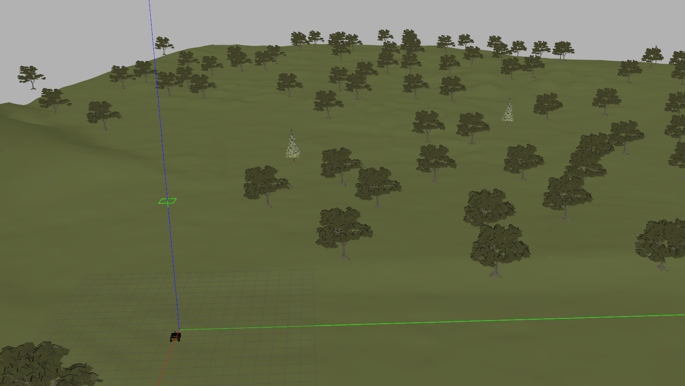
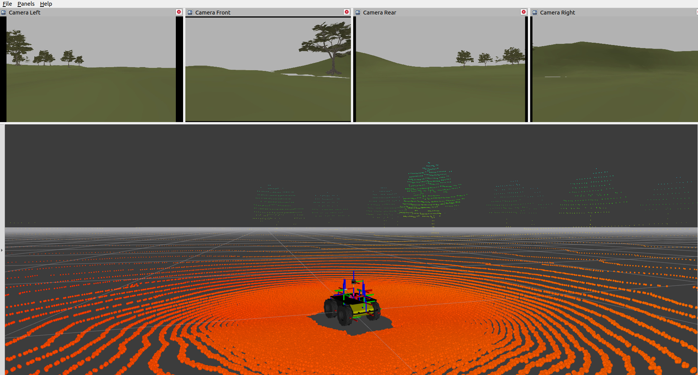

# Husky Simulation

Digital Twin Environment Development of the Forested area.
The Gazebo world is created from a pre-processed point cloud map.
The point cloud map is converted to a mesh using the [Open3d](http://www.open3d.org/) library.

Real environment aerial image and point cloud map:




Gazebo world and RViz visualization:




## Installation

Please, refer to [INSTALL.md](docs/INSTALL.md) for installation instructions.

## Running

- Husky robot spawning in Gazebo ORU campus world:
    ```bash
    roslaunch husky_sim husky_sim.launch gui:=true rviz:=true world:=/path/to/husky_sim/worlds/oru_forest.world
    ```
  Keyboard teleoperation:
    ```bash
    roslaunch husky_sim keyboard_teleop.launch
    ```

- Random path generation and following:

    ```bash
    roslaunch husky_sim husky_random_walk.launch
    ```

- Exploration with [naex](https://github.com/ctu-vras/naex) navigation pipeline:

    ```bash
    roslaunch husky_sim husky_exploration.launch
    ```
