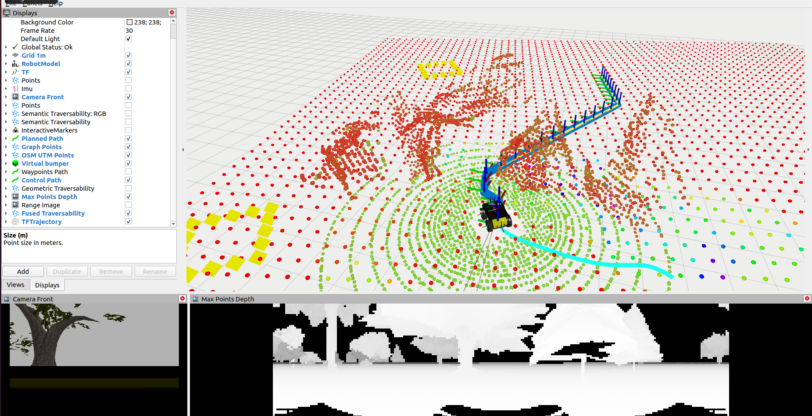

# RobinGas Mission Gazebo



RobinGas pipeline in Gazebo simulator,
[video](https://drive.google.com/file/d/1n_Ba2h8XUM64c3eQR-tHYTJO4hkhtB8i/view?usp=share_link),
currently including:

- Husky robot gazebo model with sensors (including [Ouster LiDAR Gazebo Plugin with GPU ray](https://engcang.github.io/Ouster-Gazebo-Plugin-boosting-up-with-GPU-ray)),
- [Fused localization](https://gitlab.fel.cvut.cz/cras/subt/common/cras_gps_odom),
- [Traversability estimation](https://github.com/ctu-vras/traversability_estimation),
- [Path planner](https://github.com/ctu-vras/gps-navigation/tree/master/gps_to_path),
- [Path follower](https://github.com/ctu-vras/naex/blob/master/launch/follower.launch),
- Obstacle avoidance ([virtual bumper](https://gitlab.fel.cvut.cz/cras/subt/common/augmented_robot_trackers)).

## Installation

The navigation pipeline is currently tested in simulator with Husky robot only.

- Install ROS navigation stack and Husky related packages:

  ```bash
  sudo apt-get install ros-$ROS_DISTRO-navigation
  ```
  Install husky simulation, [reference](http://wiki.ros.org/husky_navigation/Tutorials):
  ```bash
  sudo apt-get install ros-$ROS_DISTRO-husky-*
  echo "export HUSKY_GAZEBO_DESCRIPTION=$(rospack find husky_gazebo)/urdf/description.gazebo.xacro" >> ~/.bashrc
  source ~/.bashrc
  ```
- Configure ROS workspace. Download the package and its dependencies and build individual packages listed above.

  ```bash
  ws=~/catkin_ws/
  mkdir -p "${ws}/src"
  cd "${ws}/src"

  git clone https://github.com/ctu-vras/robingas_mission_gazebo

  wstool init
  wstool merge aro_slam/dependencies.rosinstall
  wstool up -j 4

  cd "${ws}"
  catkin init
  catkin config --extend /opt/ros/$ROS_DISTRO/
  catkin config --cmake-args -DCMAKE_BUILD_TYPE=Release
  catkin build -c
  ```

- Download relevant Gazebo [models](http://subtdata.felk.cvut.cz/robingas/data/gazebo/models/)
used in the virtual worlds and place them to `$HOME/.gazebo/models/` folder.

## RobinGas Navigation Pipeline

Start Gazebo simulator with Husky robot spawned:

```bash
roslaunch robingas_mission_gazebo husky_gazebo.launch
```

Launch navigation pipeline:

```bash
roslaunch robingas_mission_gazebo navigation.launch rviz:=true
```

## 2D-navigation Stack

Waypoints following example with
laser scan SLAM ([AMCL](http://wiki.ros.org/amcl)) and
[move_base](http://wiki.ros.org/move_base) navigation stack.
Bringup simulated environment and spawn a husky robot in it.
```bash
roslaunch robingas_mission_gazebo husky_amcl_move_base.launch
```
Command a robot to visit a sequence of waypoints.
```bash
roslaunch robingas_mission_gazebo send_wp_sequence.launch
```
