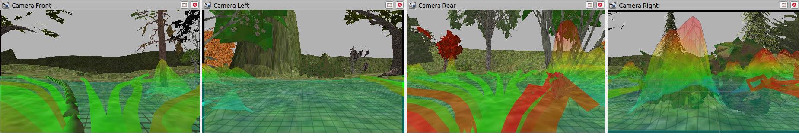
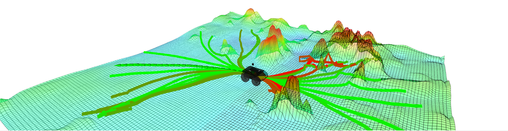

# Husky MonoForce

Navigation with Husky robot only from RGB images.
The [MonoForce](https://github.com/ctu-vras/monoforce) package is used as robot-terrain interaction and path planning pipeline.




Trajectories prediction is based on the
[NVIDIA-Warp](https://github.com/NVIDIA/warp) and
[ParallelTrackSimulator](https://github.com/tichyt11/ParallelTrackSimulator)
packages.

Navigation consists of the following stages, [video](https://drive.google.com/file/d/1OLnTtedNLX23HjNnXV7Sct_3xSFGxe2H/view?usp=sharing):
- **Image acquisition**: RGB images are acquired from the Gazebo simulator.
- **Height map prediction**: The Terrain Encoder part of the MonoForce is used to estimate terrain properties.
- **Trajectories prediction**: The Diff Physics part of the MonoForce is used to shoot the robot trajectories.
- **Trajectory selection**: The trajectory with the smallest cost based on robot-terrain interaction forces is selected.
- **Control**: The robot is controlled to follow the selected trajectory.

## Installation

Please, refer to [INSTALL.md](docs/INSTALL.md) for installation instructions.

## Usage

```bash
roslaunch husky_sim husky_monoforce.launch warp_dphys:=true
```

## Citation

Consider citing the paper if you find the package relevant to your research:

```bibtex
@article{agishev2023monoforce,
    title={MonoForce: Self-supervised Learning of Physics-aware Model for Predicting Robot-terrain Interaction},
    author={Ruslan Agishev and Karel Zimmermann and Vladimír Kubelka and Martin Pecka and Tomáš Svoboda},
    year={2023},
    eprint={2309.09007},
    archivePrefix={arXiv},
    primaryClass={cs.RO}
}
```
